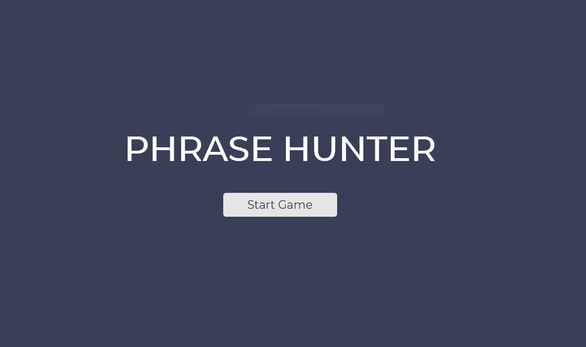
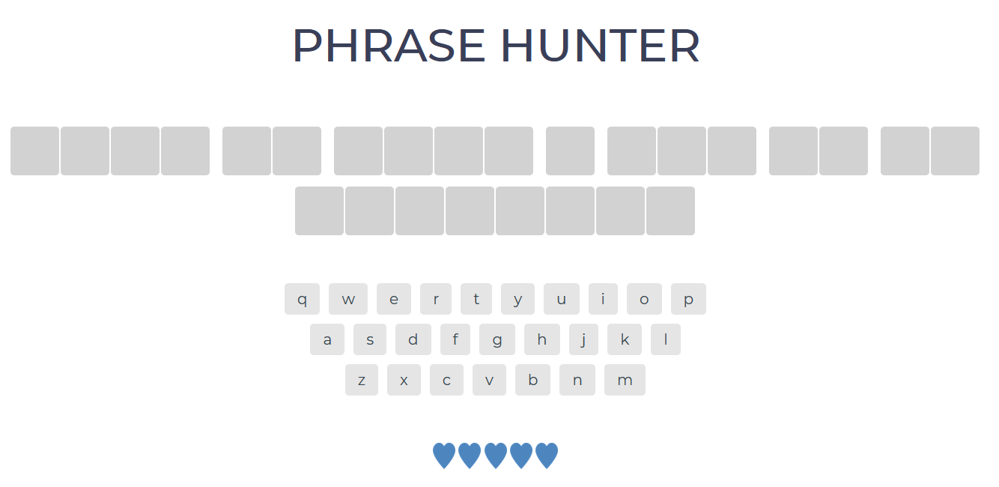

# oojs-game-phrase

In this project we work with objects, classes, DOM, events and generate random numbers.

## Installation

-   Open the Index.html file with your preferred browser.

## **Phrase Hunter**

In this game you must guess the phrase by selecting the letters.

-   First click in the button Start Game
    

*   You have 5 tries to guess the phrase, by selecting the letters
    

## Change phrases

To change the phrases, with those of your preference, you have to:

-   Open the Game.js file.
-   Change the phrases between the single quotes.

```
    new Phrase('Life is like a box of chocolates'),
    new Phrase('there is no trying'),
    new Phrase('may the force be with you'),
    new Phrase('you have to see the matrix for yourself'),
    new Phrase('YOU TALKING TO ME'),
```

## Built with

-   Javascript
-   HTML
-   CSS

## Acknowledgments

-   Thank the Treehouse team for the encouragement through each review.
